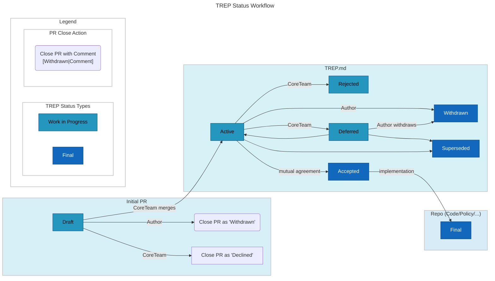

TREP: 1 
Title: TREP Purpose and guidelines 
Author: degrown 
Discussions-To: https://github.com/thinkingrock-gtd/tr-discuss-governance/discussions/31 
Status: Draft 
Created: 2023-02-15 

## Abstract

This document clarifies the purpose of the governance documents called TREP, "ThinkingRock Enhancement Proposal".
It provides users with the guidelines needed to write their own TREP. 
In conjunction with the TREP template in [TREP 7](/TREP/TREP-0007.md),
this should make it easy for anyone to create their own TREP and submit it to the ThinkingRock core team.

## Motivation

The TREP process attempts to streamline the discussion and coordination of new features or other significant changes to the ThinkingRock applications.
Having common guidelines makes it easier both for the TREP author and for the TR core team to process the ideas presented.

## Rationale

If you intend to submit a TREP, you MUST follow this guidelines,
in conjunction with the template (TREP-7), to ensure that your TREP submission won’t be rejected.

## Specification

In the following sections we'll first define the general handling of TREPs, then we'll discuss the TREP workflow.

## What is a TREP

The word TREP is an acronym and stands for "ThinkingRock Enhancement Proposal".
A TREP is a document providing information on new features for ThinkingRock (a.k.a TR),
its processes or environment to the TR community.
The TREP should provide a concise technical specification of the feature
as well as a rationale to build the feature.

We intend TREPs to be the primary mechanism for proposing major new features,
for collecting community input on an issue, and for documenting the decisions about TR organizational aspects.
The TREP author is responsible for building consensus within the community and for documenting dissenting opinions.

Every TREP must have a status.
Available Statuses are: Draft | Active | Accepted | Deferred | Rejected | Withdrawn | Final | Superseded.
The semantics of each status is described below.

## Where are TREPs stored

TREPs are stored in the code repository associated with the
[tr-discuss-governance](https://github.com/thinkingrock-gtd/tr-discuss-governance/) GitHub project.
TREPs are thus stored as text files in a version-controlled git repository,
hence the git history serves as historical record of the evolution of the feature proposal.
Anybody can access the historical record via regular git commands, or alternatively, browse it
[on GitHub](https://github.com/thinkingrock-gtd/tr-discuss-governance/tree/main/TREP).

## The TREP workflow

### TREP Initiation

The TREP process begins with a new idea for ThinkingRock.
It is highly recommended that a single TREP contains a single key proposal or new idea;
the more focused the TREP, the more successful it tends to be.
Most enhancements and bug fixes don’t need a TREP
and can be submitted directly to the issue tracker on the right project.
The TR core team reserves the right to reject TREP proposals if they appear too unfocused or too broad.
If in doubt, split your TREP into several well-focused ones.

Each TREP must have a champion – someone who writes the TREP using the style and format described below,
shepherds the discussions in the appropriate forums, and attempts to build community consensus around the idea.
The TREP champion (a.k.a. author) should first attempt to ascertain whether the idea is TREP-able.

During the TREP initiation phase, discussions may take place in the context of one or more Github discussions
in the [tr-discuss-governance](https://github.com/thinkingrock-gtd/tr-discuss-governance/discussions) repository.
For this purpose, the description field of the discussion thread can be used to evolve the draft TREP and update
it based on the discussions taking place in the comments below the description.
This gives the author a chance to flesh out the draft TREP to make properly formatted, of high quality,
and to address initial concerns about the proposal.

### TREP Submission

Once the champion has asked the TR community whether an idea has any chance of acceptance, the draft TREP
prepared in the discussion during the initiation phase can be submitted as a Pull Request to the
[tr-discuss-governance](https://github.com/thinkingrock-gtd repository. The standard TREP workflow is:

- as the TREP author, fork the [TREP repository](https://github.com/thinkingrock-gtd/tr-discuss-governance)
- open up the TREP template file (TREP-0007.md), and read it carefully
- create your new TREP following the steps on [How to use this template](/TREP/TREP-0007.md#how-to-use-this-template)

The TR core team will not unreasonably reject a TREP.
Valid reasons for denying a TREP include duplication of effort,
being technically unsound or not providing proper motivation.
Also, a TREP must not contradict the TR project guidelines, philosophy, nor objectives.

### TREP Discussion
As soon as a TREP number has been assigned and the draft TREP is committed to the
[TREP repository](https://github.com/thinkingrock-gtd/tr-discuss-governance),
the core team creates a new discussion thread on tr-discuss-governance
to provide a central place to discuss and review its contents.
The TREP should be updated so that the Discussions-To header links to it.
The initial discussion thread may be re-used for this purpose if it seems feasible.

If a TREP undergoes a significant re-write or other major, substantive changes to its proposed specification,
a new thread should typically be created in the chosen venue to solicit additional feedback.
If this occurs, the Discussions-To link must be updated.
Once the TREP is assigned a number and committed to the TREP repository,
substantive issues should generally be discussed on the canonical public thread,
as opposed to private channels, GitHub pull request reviews or unrelated venues.
This ensures everyone can follow and contribute, avoids fragmenting the discussion,
and makes sure it is fully considered as part of the TREP review process.

### TREP Review & Resolution
The final authority for TREP approval is the TR core team.
For a TREP status to be changed, it has to be approved by at least 1 (one) core team member. 

For a TREP to be accepted, it must meet certain minimum criteria:
It must be a clear and complete description of the technical or organizational proposal.

After having reached a consensus, the TR core team can decide for having an "approval deadline",
allowing also casual contributors to have time to read and think about the approved result.
The chosen deadline should reflect the importance of the matter,
usual periods may be between one week and three months after having reached the consensus.

Once a TREP has been accepted, the status will be changed to: 
- “Accepted”, if the TREP domain implies a following implementation phase
- "Final", if the TREP workflow ends here (for example: policy, documentation, etc)
If the TREP status is "Accepted", the transition to "Final" will follow the implementation on the appropriate product.

A TREP can also be assigned the status “Deferred”.
The TREP author or a TR core team member can assign the TREP this status if no activity is being made in 3 months.
After a TREP has been deferred, a TR core member may reassign it to draft status
in case the TREP should gain new traction.

A TREP can also be “Rejected”.
Perhaps after all has been said, it becomes clear that it was not a good idea.
It is still important to have a record of this fact.

The “Withdrawn” status is similar – it means that the TREP author themselves have decided to withdraw the TREP,
either because the idea did not prevail or because a competing proposal provides a better alternative.

Once a TREP is Accepted, Rejected or Withdrawn, the TREP should be updated accordingly.

TREPs can also be superseded by a different TREP, rendering the original obsolete.

### Overview on the status workflow

## Backwards Compatibility

## Security Implications

## Rejected Ideas

## Open Issues

## Copyright

This document is placed in the public domain or under the CC0-1.0-Universal license,
whichever is more permissive.

## Footnotes

